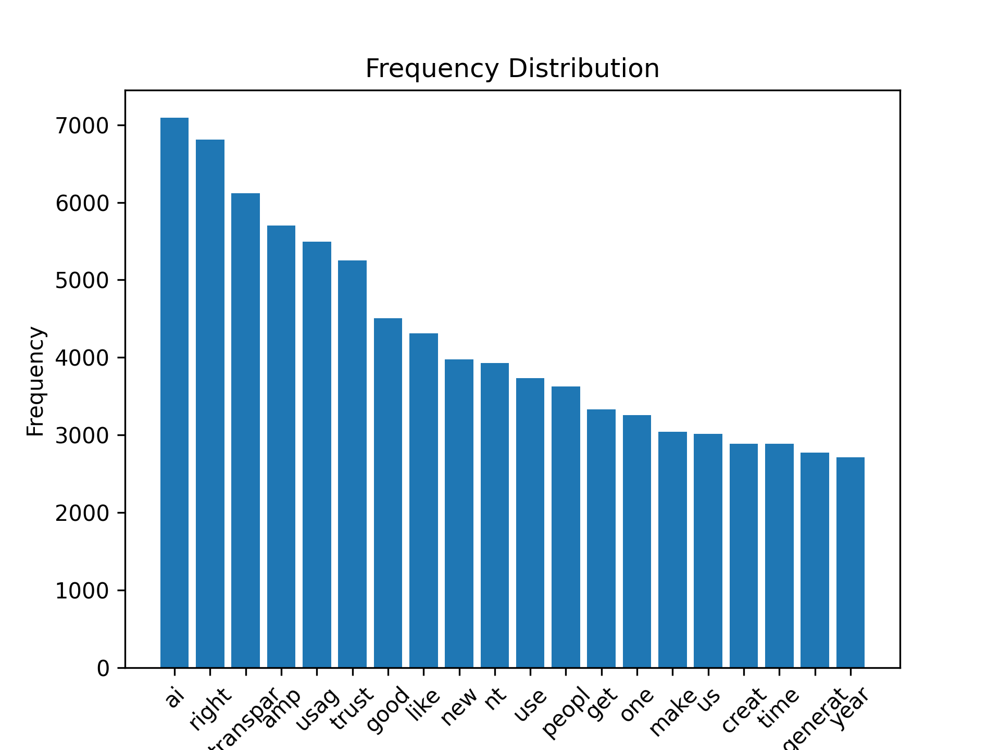
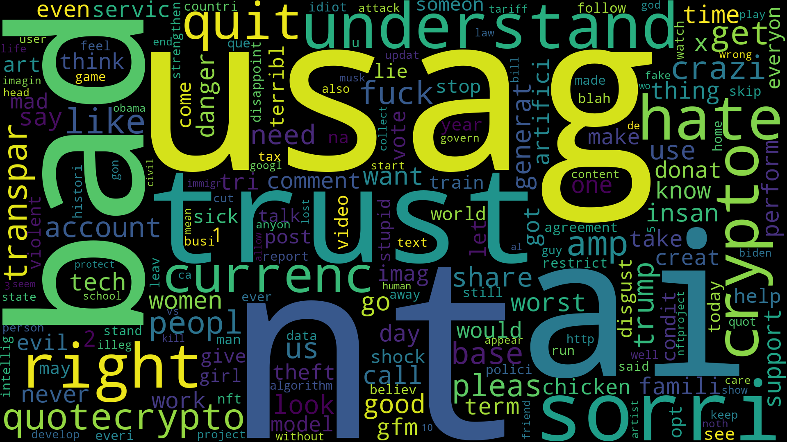
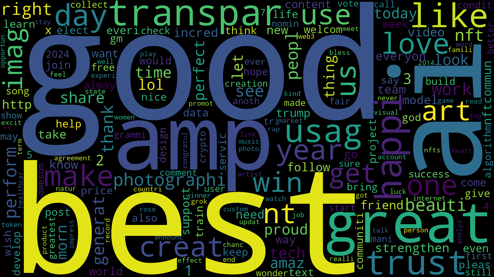
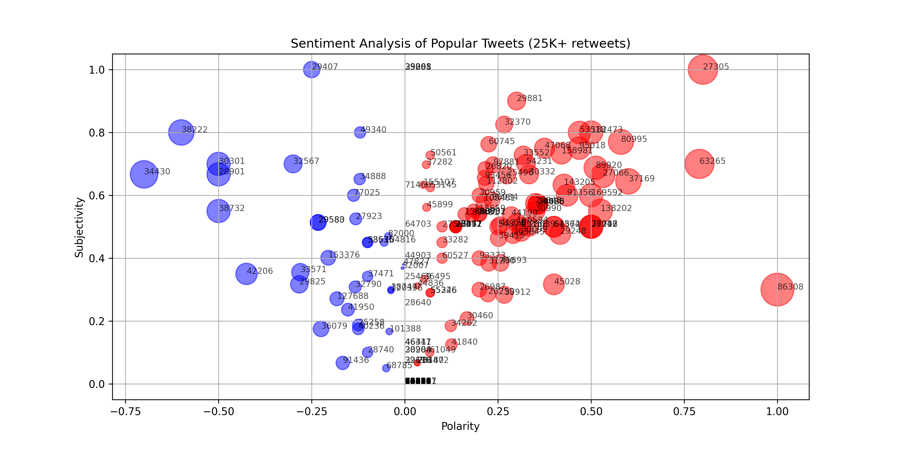
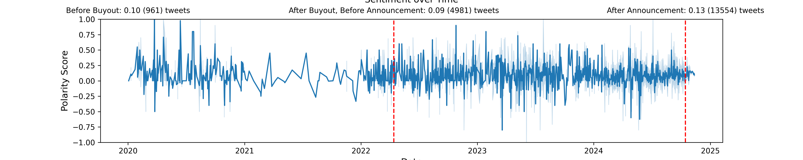
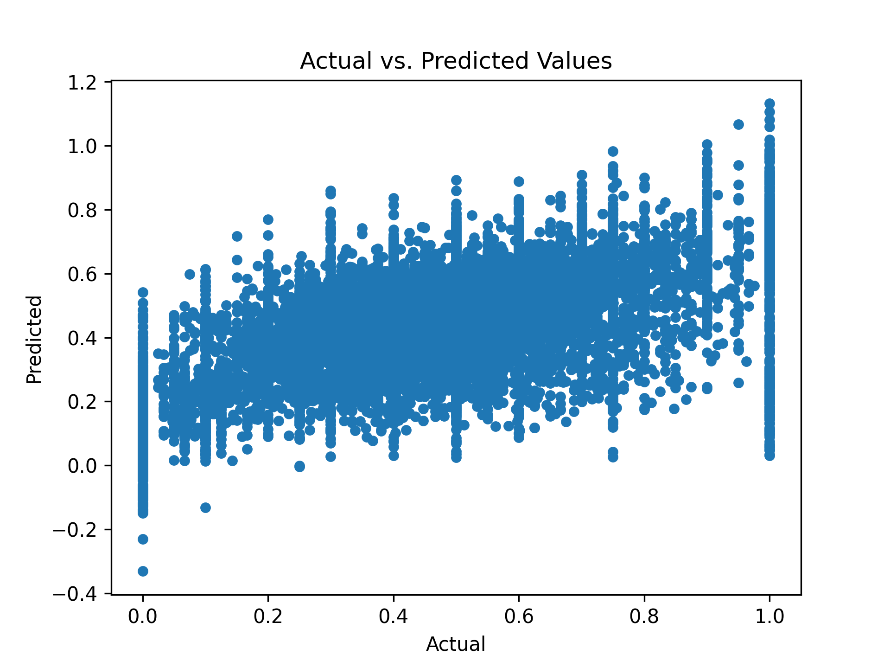

# Project Title: comp3800f24_project
This project uses a spreadsheet of tweets scraped from X in order to analyze and visualize
the sentiments of users, specifically in regards to the changes made to the X
terms of service, announced on October 15th, 2024, allowing the use of any image or artwork uploaded
to the platform to be used for training on Elon Musk's GrokAI.

## Jupyter Notebook
The analysis and code are available in the comp3800f24_project.ipynb file.

## Data
**Data Collection: ** 
Apify, a web scraping platform, was used to scrape tweets from X. This is due to the fact
that X itself doesn't allow users to directly download tweets from other users. Furthermore,
Apify is a ready-made tool, designed to allow users to download thousands of tweets in meer
minutes. This process would be much more arduous without the use of Apify. Amongst all
my collaborators in finding the dataset of tweets, we used $78.12 of Apify credit.

**Dataset Used:** 
This dataset is the concatenation of many scrapes on Apify using the keywords
listed in comp3800f24_keywords.txt, creating one large cohesive dataset.
The dataset is 25.7 MB large or 25M (megabytes), 700N (kilobytes).

**Preprocessing:**
Before using the tweet dataset in this project, I dropped all but the desirable columns
that can be seen in comp3800f24_tweets.txt, except for the type column which will be dropped 
in the initialization of this project. Furthermore, I removed any tweets with null values
and any tweets that were duplicates of a tweet already in the dataset. Doing these 
tasks before using the dataset in this project greatly reduces the size of the dataset
and makes reading in the file much faster.
 
## Results

### Key Insights
1. AI appears as one of the most common stems in both high and low polarity tweets, indicating a great deal of mixed 
opinion on the matter. AI appears to be both beloved and hated by large numbers of people.
2. Of the most popular tweets, (25,000+ retweets) the majority of the tweets have a positive polarity, indicating that a 
tweet is slightly more likely to be retweeted if the sentiment or content of the tweet is good and uplifting. This can also be 
seen due to the fact that the average polarity of tweets in this range is 0.09.
3. After the X buyout but before the announcement the polarity of tweets that contained the word "ai" was only 0.09, while
the polarity of tweets after the announcement rose to 0.13. After the announcement, the number of tweets containing talk about "ai" rose 
dramatically, as did the sentiment. It appears as though the people actively using X after this announcement generally viewed AI positively. 
Perhaps those most upset by the change left the platform entirely while the tech savy were driven in.

### Visualizations
Here are some key visualizations from the project:

#### Plot 1: Used stemming, breaking up the words in all the tweets and shortening them down to their roots,
#### to find all the stems within the dataset. This graph shows the top 20 most common stems and their frequencies.

#### Wordcloud 1: Used stemming similarly to plot 1; however, stems were only taken from tweets with polarities
#### that are less than -0.5. Created a wordcloud (using the import) to show all the most common negative stems.

#### Wordcloud 2: Performed the same process as wordcloud 1, except stems were only taken from tweets with
#### polarities that are greater than 0.5, showcasing only the most common positive stems.

#### Plot 2: Used TextBlob to uncover the sentiments of all the tweets that had a retweet count greater than
#### 25,000. Plotted based off polarity and subjectivity, coloring the positive and negative tweets red and blue.

#### Plot 3: Plotted sentiment as a function of time, showing the polarity as a seaborn line graph across multiple
#### years. X's buyout as well as the date of the announcement are clearly indicated, with the number of tweets
#### and the average polarity listed in each section on the graph.

#### Plot 4: Trained an algorithm using Word2Vec vectorization, converting written words to numbers, vectors, that
#### are more easily used for machine learning and computer applications, to predict the subjectivity of a tweet.

## How to Run
- Clone the repository: git clone https://github.com/EzraBenjaminJones/comp3800f24_project.git
- Install dependencies: pip install -r requirements.txt
- Open the notebook: jupyter notebook comp3800f24_project.ipynb
- Must uncompress data.zip to a folder named data.
- Must run if nltk.stopwords is not already installed (currently commented out): nltk.download('stopwords')
